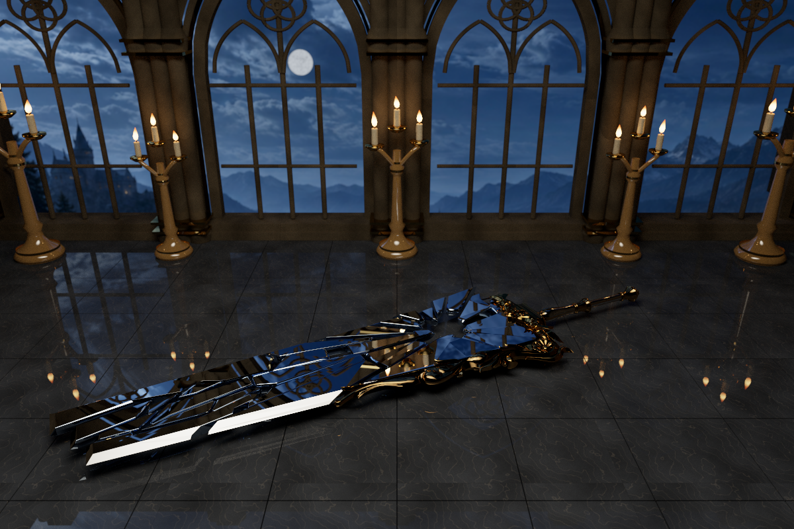
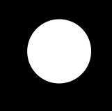
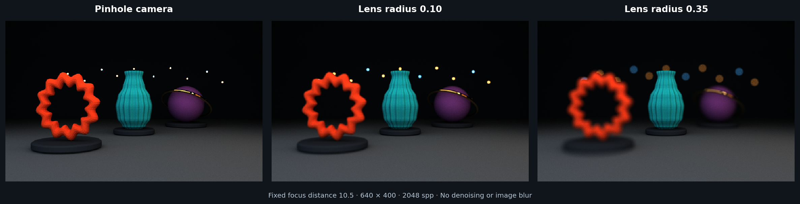
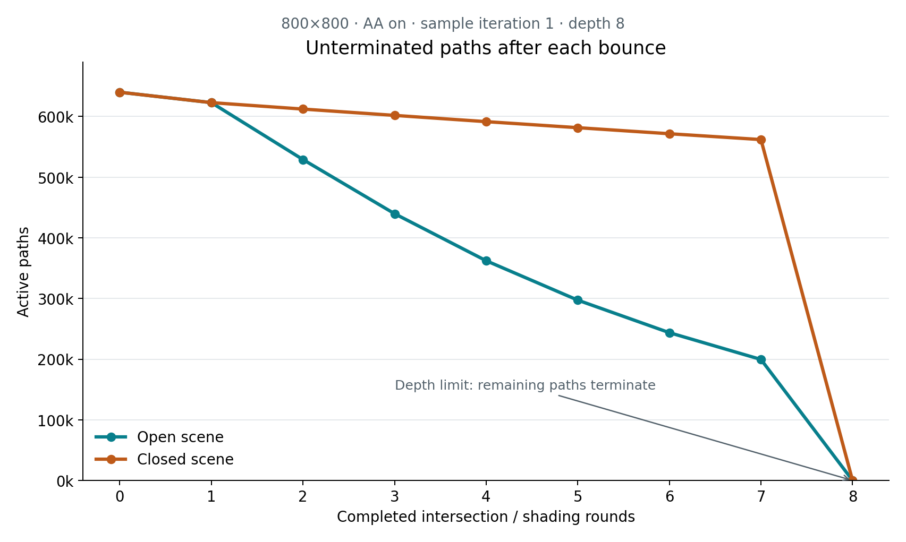
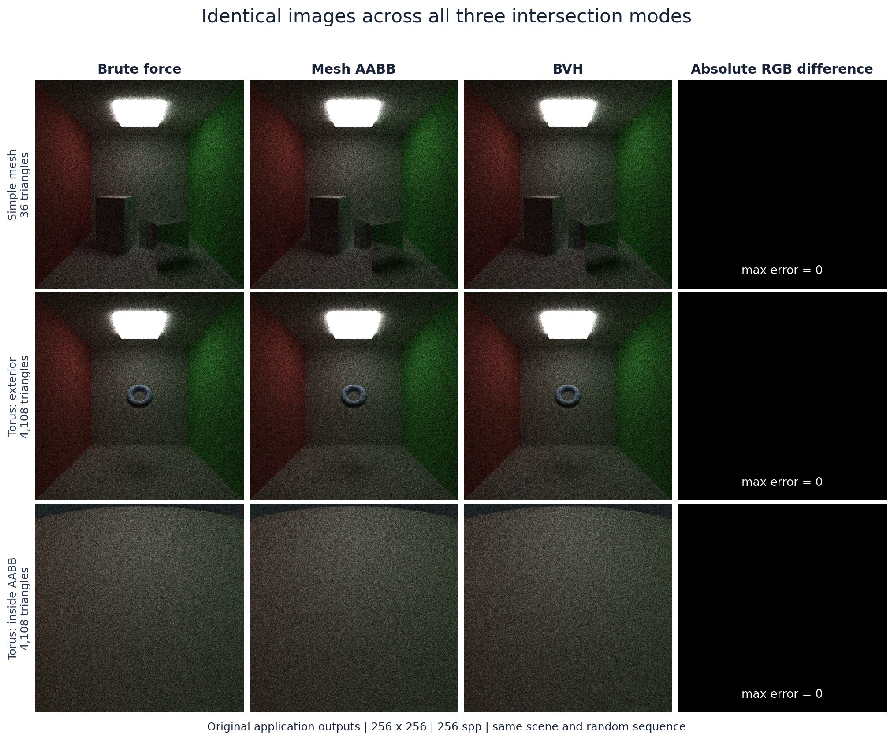
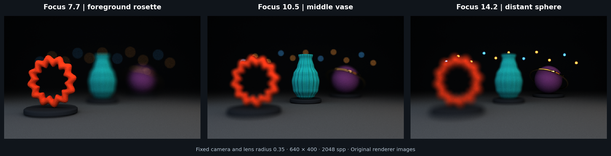
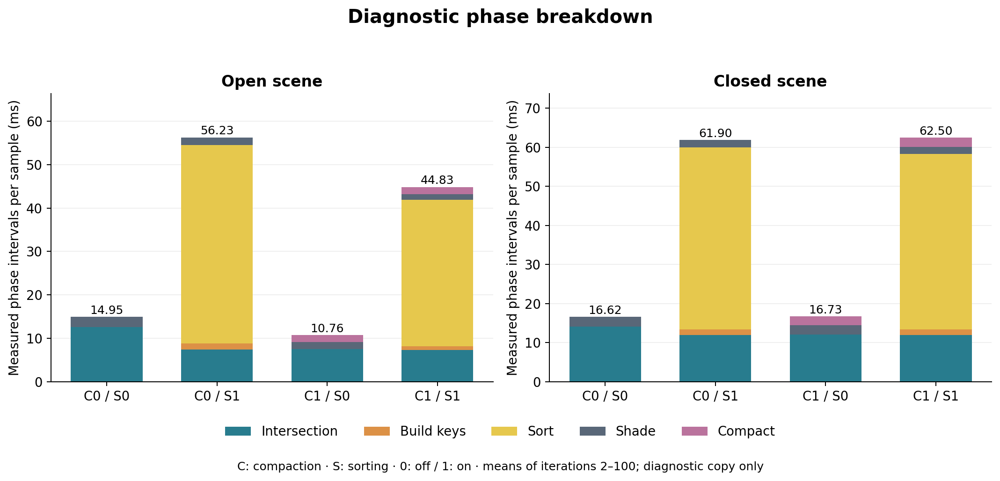

# CUDA Path Tracer

**Author: Qingyao Tian** · University of Pennsylvania, CIS 565

A progressive CUDA renderer for textured meshes, diffuse and mirror reflections, and physical depth of field. Mesh acceleration and GPU traversal optimizations render the showcase below in about **4 minutes 27 seconds** at 3072 samples per pixel.



*Broken Blade — 1200 × 800, 3072 samples per pixel (spp), maximum path depth 8; 86,355 triangles across 16 meshes. Render-loop time: 267.498 s on an RTX 4070 Laptop GPU. [Capture settings](docs/data/compact_bvh_verification.json).*

The fractured blade reflects tall windows and candlelight above a textured stone floor. The scene combines imported weapon geometry, an offline-generated hall, emissive geometry, and a thin-lens camera. Exposure and tone mapping produce the displayed image; no denoising is applied.

## Rendering features

- **Light transport:** multiple bounces with cosine-weighted diffuse scattering, ideal mirror reflection, emissive surfaces, and diffuse/specular mixtures.
- **Camera:** stochastic antialiasing and a thin lens with adjustable aperture radius and focus distance.
- **Geometry:** spheres, boxes, and OBJ meshes; independent corner UVs/normals, optional smooth shading, and base-color textures.
- **Acceleration:** CPU-built bounding volume hierarchies (BVHs), GPU traversal, active-path compaction, and optional grouping by material.
- **Output:** a progressive OpenGL preview with camera controls, plus headless PNG, linear HDR, and float32 RGB capture.

The CPU loads scene assets and builds one BVH per mesh. Each GPU iteration generates camera paths, finds intersections, shades surfaces, and packs surviving paths for the next bounce. Contributions accumulate by pixel across iterations. The main implementation is in [pathtrace.cu](src/pathtrace.cu), with [surface scattering](src/interactions.cu), [intersection routines](src/intersections.cu), and the [BVH builder](src/bvh.cpp).

## Image quality

### Stochastic antialiasing

Antialiasing (AA) samples a random camera-ray position within each pixel. Averaging these samples captures partial pixel coverage and smooths silhouettes. This emissive-sphere comparison isolates edge coverage from indirect-lighting noise: 161 × 159, 1000 spp, depth 1.

| Pixel-center sampling | Stochastic sampling |
| --- | --- |
|  |  |

[Additional scene comparisons and timings](#additional-results-and-data) show the same switch in a lit scene.

### Physical depth of field

Depth of field (DOF) uses a [thin-lens model](https://pbr-book.org/4ed/Cameras_and_Film/Projective_Camera_Models#TheThinLensModelandDepthofField): sample a circular aperture uniformly by area and direct each ray toward its point on the focal plane. Aperture radius controls defocus; focus distance selects the sharp plane. A zero radius produces a pinhole camera, and lens sampling uses a random stream independent of pixel jitter.



*640 × 400, 2048 spp, depth 8; focus distance 10.5. Radii 0.10 and 0.35 progressively blur the foreground and background while keeping the middle vase in focus.*

For the still life at 320 × 200, 128 spp, depth 8, enabling the lens changes the six-run render-loop median from **637.333 to 643.098 ms** with AA/compaction/BVH on and sorting off. The 0.9% difference has overlapping timing ranges; lens rays also change intersection work and sampling variance. [Timing and convergence data](docs/data/dof_verification.json).

Independent lens samples fit GPU parallelism naturally. A CPU implementation could distribute them across threads/SIMD, but would perform the same sampling arithmetic. BVH traversal and compaction reduce downstream work; zero aperture skips lens sampling. Precomputing the lens frame, improving sample distribution, and reusing uploaded geometry when refocusing are possible further improvements.

## Performance

Measurements use **Release builds on Windows 11, Intel Core i7-14650HX, RTX 4070 Laptop GPU (8 GiB), 32 GiB RAM, and CUDA 12.9**. GPU clocks were not locked.

**Render-loop** time includes GPU completion and image readback, excluding scene loading, initialization, warmup, and saving. **Whole-program** time also includes startup, preview, and saving. CUDA-event phase intervals come from separate diagnostic runs. Reported ranges are observed min–max values, not confidence intervals; CPU comparisons below are qualitative.

### Showcase performance

The baseline uses median-split mesh BVHs with four-triangle leaves, per-stage synchronization, and per-sample image readback. The optimized configuration uses **16-bin surface-area heuristic (SAH) splits, one-triangle leaves, 32-byte GPU nodes, and reduced traversal and transfer overhead**.

| Workload | Median-BVH baseline | Optimized renderer | Approximate speedup |
| --- | ---: | ---: | ---: |
| 64 spp, repeated-run median | 16.873 s | **5.571 s** | 3.03× |
| 3072 spp, full showcase capture | 810.481 s (13 min 30 s) | **267.498 s (4 min 27 s)** | 3.03× |

Both use the same scene at 1200 × 800, depth 8, with AA/compaction/BVH/DOF on and sorting off. The 64-spp medians use five baseline and eight optimized runs; full-frame times are one measured capture each. Because these measurements come from separate batches, **3.03× speed / 67% less time** is an approximate overall comparison. Individual optimization ratios below use their own baselines and should not be multiplied. [Exact values and measurement conditions](docs/data/performance_summary.json).

SAH provides most of the gain by reducing unnecessary triangle and bounding-box tests. Traversal arithmetic, leaf size, and node layout reduce the cost of the remaining queries. Robust triangle arithmetic also improves intersections near very thin triangles and shared edges.

### Stream compaction and material sorting

After shading, completed paths save their contribution and `thrust::remove_if` packs the survivors. Pixel identities and random seeds stay attached to each path, so reordering preserves the samples assigned to each pixel. Compaction is independently toggleable.

| Scene | Compaction off | Compaction on | Speedup |
| --- | ---: | ---: | ---: |
| Open | 19.653 s | 15.025 s | 1.308× |
| Closed | 21.394 s | 21.264 s | 1.006× |

*800 × 800, 1000 spp, depth 8, AA on; three-run whole-program medians after warmup. Both scenes use the same camera; the closed scene adds a wall behind it.*



*Surviving paths in sample iteration 1, counted after each shading pass. The final drop includes depth-limit termination.*

Rays can escape the open scene, leaving less work at later bounces. The closed scene retains more paths, so selection and data movement nearly cancel the savings. A CPU tracer also benefits from removing completed paths; on the GPU, compaction additionally avoids launching mostly inactive thread blocks. Compacting only when enough paths have ended could reduce overhead.

Material grouping uses `thrust::sort_by_key` on paired path/intersection records so neighboring GPU threads take the same shading branch. In a separate three-run benchmark at the same resolution/spp/depth, with compaction enabled, sorting changes open-scene time from **13.946 to 47.561 s** and closed-scene time from **20.121 to 64.881 s**. These diffuse and mirror models are inexpensive: classifying, sorting, and moving records costs more than the shading uniformity saves. Sorting is available as a comparison option and is disabled in the showcase. Compact indices or category partitioning may suit more expensive material models better. [Phase breakdown and data](#additional-results-and-data).

### OBJ meshes and BVH

The [OBJ reader and ear-clipping triangulator](src/objLoader.cpp) use only the C++17 standard library. They preserve independent corner UV/normal indices and polygon winding, and support triangles and simple planar polygons, including concave faces. Materials are assigned per mesh in scene JSON. [Supported input](external/THIRD_PARTY.md#supported-obj-input).

A mesh's axis-aligned bounding box (AABB) can reject a ray before any triangle tests. A BVH divides that mesh into nested boxes, allowing the GPU to skip smaller regions as well. Trees are built on the CPU and traversed iteratively on the GPU, visiting nearer children first and pruning beyond the closest known hit.

| Scene | Brute force | Mesh AABB | BVH | BVH speedup vs. brute force |
| --- | ---: | ---: | ---: | ---: |
| Simple meshes, 36 triangles | 0.911 s | 0.914 s | 0.930 s | 0.98× |
| Torus, exterior view | 5.666 s | 4.383 s | 0.939 s | 6.04× |
| Torus, inside its AABB | 5.856 s | 5.425 s | 0.952 s | 6.15× |

*256 × 256, 64 spp, depth 8; AA/compaction on, sorting off. Six-round whole-program medians after warmup; torus scenes contain 4,108 triangles. All modes include the same tree build/upload work, isolating traversal choices.*

BVH helps larger meshes even when the ray starts inside the root box. For tiny meshes, traversal overhead can outweigh pruning. The modes render the same geometry and appearance; their [image comparison](#additional-results-and-data) accompanies the timing data.

A CPU tracer receives the same geometric pruning. GPU execution adds parallelism across rays, but divergent traversal, scattered reads, and per-thread stacks incur costs. The implementation addresses these with SAH splits, compact nodes, and traversal tuning. Caching repeated meshes, directly scanning very small meshes, and further register/stack profiling remain useful directions.

### Optimization methods and experiments

<details>
<summary>How each optimization changes the work and runtime</summary>

The following comparisons isolate individual design choices. Each table specifies its configuration; sample counts and image settings are held fixed within an experiment.

#### Scheduling and closest-distance pruning

Image accumulation stays on the GPU until readback is needed, and headless capture skips preview conversion. Release launches are checked without forcing a device synchronization after every stage. Each mesh query receives the closest hit already found in other objects, allowing it to reject geometry that cannot improve the result.

| Configuration | Render-loop median |
| --- | ---: |
| Per-stage synchronization, per-sample readback, unbounded mesh queries | 16.830 s |
| Deferred synchronization/readback | 16.715 s |
| Closest-distance pruning | 15.710 s |
| Both | **15.641 s** |

*1200 × 800, 64 spp, depth 8; five rotated rounds, eight warmup samples. Median-split BVH with four-triangle leaves; AA/compaction/BVH/DOF on, sorting and profiler off.*

Together these changes reduce time by **7.1%** against the 16.830 s control in the same executable. Image transfers drop from 64 to 1, or 737.28 to 11.52 MB. Separate profiling attributes about **98%** of the optimized loop to intersection intervals, making traversal the main remaining cost. Host synchronization waits overlap GPU work, so their full duration is not removable overhead.

Closest-distance pruning also helps a CPU tracer; reducing CUDA synchronization and transfers addresses GPU-specific overhead. [Phase breakdown](docs/images/render_optimization.png) · [Raw timings](docs/data/render_optimization_timings.csv) · [Measurement details](docs/data/render_optimization.json).

#### SAH split quality

The builder evaluates **16-bin SAH splits along all three centroid axes**, estimating traversal cost from child surface area and triangle count. A leaf cap and depth limit bound recursion; degenerate bins use median splitting.

| Maximum triangles per leaf | Median split | Binned SAH |
| --- | ---: | ---: |
| 2 | 14.497 s | **5.820 s** |
| 4 | 15.515 s | 5.939 s |
| 8 | 17.122 s | 6.339 s |

*1200 × 800, 64 spp, depth 8; six rotated rounds, eight warmup samples. AA/compaction/BVH/DOF and distance pruning on; sorting/profilers off. This comparison uses single-precision triangle tests.*

At a fixed four-triangle leaf cap, SAH gives **2.61× speedup**. SAH/two-triangle leaves give **2.67×** versus median/four. This shows that split quality explains most of the improvement. The latter comparison increases CPU construction from 18.604 to 74.552 ms and GPU node/index storage from 2.509 to 4.209 MB.

A separate diagnostic samples the same 167,868 incoming path segments over four spp. Triangle tests fall from 3,966,076 to 641,518 (**83.8% fewer**), and node visits from 14,563,176 to 4,448,166 (**69.5% fewer**). Instrumentation is disabled for timing runs. SAH construction is a one-time CPU cost per scene load/rebuild, while geometric pruning benefits every subsequent ray on either CPU or GPU. [Timing/work figure](docs/images/bvh_sah_performance.png) · [Timings](docs/data/bvh_sah_timings.csv) · [Per-mesh/per-bounce work](docs/data/bvh_sah_work.csv).

#### Robust intersections and traversal cost

Very thin triangles and shared edges are sensitive to floating-point rounding. The renderer uses double-precision ray-aligned edge functions, promoting coordinates before subtraction and preserving shared-edge sign symmetry. The resulting barycentric weights also interpolate UVs and smooth normals. The geometric approach follows [PBRT's triangle discussion](https://pbr-book.org/4ed/Shapes/Triangle_Meshes).

Traversal caches ray-direction reciprocals, keeps the near child active while stacking deferred siblings, and omits repeated structural checks once the CPU has validated the tree. Conservative bounds and stack limits remain part of traversal.

| Triangle / traversal arithmetic | Render-loop median |
| --- | ---: |
| Single-precision triangles | 5.822 s |
| Robust triangles, division-based checked traversal | 7.148 s |
| Robust triangles, optimized traversal | **5.885 s** |

*1200 × 800, 64 spp, depth 8; six rotated rounds, eight warmup samples; SAH with two-triangle leaves and profilers off.*

Traversal tuning removes **17.7%** of the robust reference's runtime. Its median is only 1.1% above the single-precision implementation, with overlapping ranges. This comparison demonstrates the cost of improved numerical robustness rather than a speedup over float arithmetic. Corrected boundary intersections make small image differences, documented in the [numerical study](docs/data/robust_traversal_verification.json). [Timing ranges](docs/images/robust_traversal_performance.png) · [Raw timings](docs/data/robust_traversal_timings.csv).

#### Leaf size and compact nodes

The default combines **one-triangle leaves with 32-byte GPU nodes**. Child indices and leaf ranges share two integer fields, while all six float bounds remain unquantized. CPU nodes use 40 bytes; the selected representation is uploaded to the GPU.

| Node layout / leaf cap | Render-loop median |
| --- | ---: |
| 40 bytes / 2 triangles | 5.890 s |
| 40 bytes / 1 triangle | 5.778 s |
| 32 bytes / 2 triangles | 5.737 s |
| **32 bytes / 1 triangle** | **5.578 s** |

*1200 × 800, 64 spp, depth 8; five rotated rounds, eight warmup samples; robust triangle arithmetic, AA/compaction/BVH/DOF and distance pruning on, sorting/profilers off.*

The default saves **5.3% time** against 40-byte/two-triangle nodes. One-triangle leaves reduce sampled triangle tests by 8.6%, at the cost of 12.0% more node visits. Packing alone preserves the work counts and reduces per-query cost; cache behavior was not measured directly.

Smaller leaves require a larger tree: total GPU node/index storage rises from **4.209 to 5.872 MB**, despite each node being smaller, and CPU build time rises from about **75 to 109 ms**. These settings favor this showcase; leaf size and layout are configurable for other scenes. [Leaf sweep and timing ranges](docs/images/compact_bvh_performance.png) · [Timings](docs/data/compact_bvh_timings.csv) · [Traversal counts](docs/data/compact_bvh_work.csv).

#### Exploring object-level acceleration

An additional experiment places world-space bounds around entire meshes, then compares a linear bounds scan with a top-level BVH (TLAS) over those meshes. This targets the cost of querying many separate objects before traversing their triangle BVHs.

| Object selection method | Render-loop median |
| --- | ---: |
| Query each mesh BVH | **5.571 s** |
| World-space mesh AABB scan | 5.567 s |
| Top-level BVH | 6.974 s |

*1200 × 800, 64 spp, depth 8; eight rotated rounds with eight warmup samples; SAH/one-triangle leaves/compact mesh nodes, AA/compaction/BVH/DOF on, sorting/profilers off.*

The AABB scan removes about 79% of mesh queries, but mainly replaces cheap root-box rejections: internal node visits and triangle tests remain unchanged. Its timing difference is below 0.1%. TLAS reduces triangle tests by only 3.75%, while adding another traversal and stack, making it **25.2% slower**. The scene has just 16 meshes with large, overlapping extents, limiting object-level pruning. Consequently, the renderer uses mesh BVHs directly; a scene with many spatially separated objects would be a more suitable case to investigate TLAS. [Work counts and timings](docs/data/object_acceleration_verification.json) · [Raw runs](docs/data/object_acceleration_timings.csv).

</details>

## Build and run

The supported Windows setup uses CMake 3.24+, Visual Studio 2022 C++ tools, CUDA 12.9, and the bundled graphics dependencies. From the repository root, adjusting the CUDA path if needed:

```powershell
cmake -S . -B build -G "Visual Studio 17 2022" -A x64 -T "cuda=C:\Program Files\NVIDIA GPU Computing Toolkit\CUDA\v12.9" -DBUILD_TESTING=ON
cmake --build build --config Release --parallel
ctest --test-dir build -C Release --output-on-failure
.\build\bin\Release\cis565_path_tracer.exe scenes/shatterseal_moonlit_hall_refined_preview.json
```

CMake extensions beyond source-file lists include the headless `scene_render` target and CPU/GPU CTest targets with their include paths, CUDA compilation properties and test settings. C++/CUDA 17 is used throughout.

The [preview](scenes/shatterseal_moonlit_hall_refined_preview.json) uses 600 × 400, 256 spp and a pinhole camera. The [full scene](scenes/shatterseal_moonlit_hall_refined.json) uses the cover settings; the [detail camera](scenes/shatterseal_moonlit_hall_refined_detail.json) provides a closer view. Scene asset paths are relative to the JSON file.

Mouse: left drag orbits, right drag zooms, middle drag pans. `S` saves; `Esc` saves and exits; `Space` resets the look-at point. ImGui exposes sampling, acceleration, path organization and lens controls. Camera or rendering changes restart accumulation.

Headless capture writes PNG, HDR, float32 RGB and a JSON timing record:

```powershell
New-Item -ItemType Directory -Force build/captures | Out-Null
.\build\bin\Release\scene_render.exe scenes/shatterseal_moonlit_hall_refined.json build/captures/moonlit_hall.json
```

For `scene_render`, BVH defaults are `--bvh-builder sah --bvh-leaf-size 1 --bvh-bins 16 --bvh-layout compact`. Compare construction with `--bvh-builder median`, leaf size with `--bvh-leaf-size N`, and layout with `--bvh-layout wide`.

For diagnostics, `--profile` records CUDA-event phase intervals, while `--profile-intersections --intersection-profile-stride 64` records sampled per-mesh/per-bounce work with BVH enabled. Disable both profilers for timing comparisons. Scheduling/pruning controls are `--sync-every-stage`, `--readback-every-sample`, `--display-every-sample` and `--no-distance-pruning`. `--reference-traversal` selects division-based, fully checked traversal; `--checked-traversal` enables per-node checks with reciprocal caching. Debug builds synchronize each stage by default.

### Scene configuration

JSON scenes contain `Materials`, `Objects` and `Camera`. The renderer extends this format with:

| Section | Fields | Purpose |
| --- | --- | --- |
| Objects | `TYPE: "mesh"`, `FILE`, `SMOOTH_NORMALS` | Load an OBJ and optionally interpolate its corner normals |
| Materials | `BASE_COLOR_TEXTURE`; `TYPE: "CoatedDiffuse"`, `COAT_WEIGHT` | Sample a base-color image; mix diffuse and ideal reflection |
| Camera | `ANTIALIASING`, `STREAM_COMPACTION`, `MATERIAL_SORTING` | Toggle pixel jitter, active-path packing and material grouping |
| Camera | `BVH`, `MESH_CULLING` | Choose hierarchical, single-box or brute-force mesh queries |
| Camera | `DEPTH_OF_FIELD`, `LENS_RADIUS`, `FOCAL_DISTANCE` | Control the thin lens; distances are in world units |
| Camera | `DISPLAY_TRANSFORM`, `EXPOSURE` | Apply exposure in stops, Reinhard tone mapping and sRGB output |

For brute force set `BVH=false, MESH_CULLING=false`; for one mesh AABB use `false,true`; for hierarchical traversal use `BVH=true`. Each mesh receives one JSON material; MTL shading is not imported automatically. Textured meshes require UVs. [OBJ input details](external/THIRD_PARTY.md#supported-obj-input).

## Limitations

Materials support ideal reflection and diffuse/specular mixtures; rough microfacet reflection, refraction and normal mapping are possible extensions. Small emitters are reached through scattered paths, so direct-light sampling would improve convergence. The exterior uses a finite textured backdrop rather than an environment-map system. Per-sample speed improvements and improved convergence are separate goals.

## Credits

- **Framework:** University of Pennsylvania's [CIS565 CUDA Path Tracer](https://github.com/CIS5650-Fall-2025/Project3-CUDA-Path-Tracer).
- **Weapon model:** Monster Hunter Wilds.
- **Scene assets:** Hall geometry and procedural textures were generated for this project. The distant night backdrop was created with OpenAI image generation ([prompt](docs/data/sky_prompt.txt)).
- **Libraries:** CUDA/Thrust, GLM, nlohmann/json, stb, GLFW/GLEW/OpenGL, and Dear ImGui. See [dependencies and OBJ input details](external/THIRD_PARTY.md).

## Additional results and data

<details>
<summary>More image comparisons, phase timings and measurement records</summary>

**Mesh acceleration.** Brute force, mesh AABB and BVH produce the same image at 256 × 256, 256 spp, depth 8. Acceleration changes the work needed to find an intersection; the timing table uses 64 spp.



**Changing focus.** At aperture radius 0.35, focus distances 7.7 / 10.5 / 14.2 move the sharp region. Each panel is 640 × 400, 2048 spp, depth 8.



**Material sorting.** These separate diagnostic intervals include Thrust dispatch/allocation/synchronization gaps and exclude camera generation, accumulation and display.



| Topic | Figures | Measurement records |
| --- | --- | --- |
| Antialiasing | [Cornell off](docs/images/aa_cornell_off.png) / [on](docs/images/aa_cornell_on.png) | [Timings](docs/data/aa_timings.csv) |
| Compaction | [Open](docs/images/compaction_open.png) / [closed](docs/images/compaction_closed.png) | [Timings](docs/data/compaction_timings.csv), [paths per bounce](docs/data/compaction_path_counts.csv) |
| Material sorting | [Material grouping](docs/images/sorting_material_order.png) | [Timings](docs/data/sorting_timings.csv), [phase intervals](docs/data/sorting_phase_timings.csv), [grouping counts](docs/data/sorting_material_layout.csv) |
| Mesh loading / BVH | [Imported meshes](docs/images/mesh_import.png), [timing ranges](docs/images/bvh_performance.png) | [BVH timings](docs/data/bvh_timings.csv), [experiment settings](docs/data/bvh_verification.json), [AABB comparison](docs/data/aabb_results.json) |
| Depth of field | [Performance](docs/images/dof_performance.png), [convergence](docs/images/dof_convergence.png) | [Timings](docs/data/dof_timings.csv), [convergence data](docs/data/dof_convergence.csv), [experiment settings](docs/data/dof_verification.json) |
| Showcase | [Lighting variation](docs/images/hall_before.png), [moonlit hall](docs/images/showcase.png) | [Performance summary](docs/data/performance_summary.json), [full capture](docs/data/compact_bvh_verification.json) |
| Scheduling / distance pruning | [Phase breakdown](docs/images/render_optimization.png) | [Timings](docs/data/render_optimization_timings.csv), [profiling](docs/data/render_optimization.json) |
| SAH splits | [Timing and work counts](docs/images/bvh_sah_performance.png) | [Timings](docs/data/bvh_sah_timings.csv), [work counts](docs/data/bvh_sah_work.csv) |
| Triangle precision / traversal | [Timing ranges](docs/images/robust_traversal_performance.png) | [Timings](docs/data/robust_traversal_timings.csv), [numerical study](docs/data/robust_traversal_verification.json) |
| Leaf size / node layout | [Leaf sweep](docs/images/compact_bvh_performance.png) | [Timings](docs/data/compact_bvh_timings.csv), [work counts](docs/data/compact_bvh_work.csv) |
| Object-level acceleration | [Timing comparison](docs/images/object_acceleration_comparison.png) | [Timings](docs/data/object_acceleration_timings.csv), [work counts](docs/data/object_acceleration_verification.json) |

DOF convergence uses each mode's own 8192-spp reference with disjoint sample numbers. Intentional defocus is not an error; the references still contain noise, so these values do not establish runtime at equal quality.

Each dataset records its scene, settings and measurement scope. [Image/data origins and hashes](docs/data/evidence_manifest.json) · [Hardware details](docs/data/host_environment.json).

</details>
