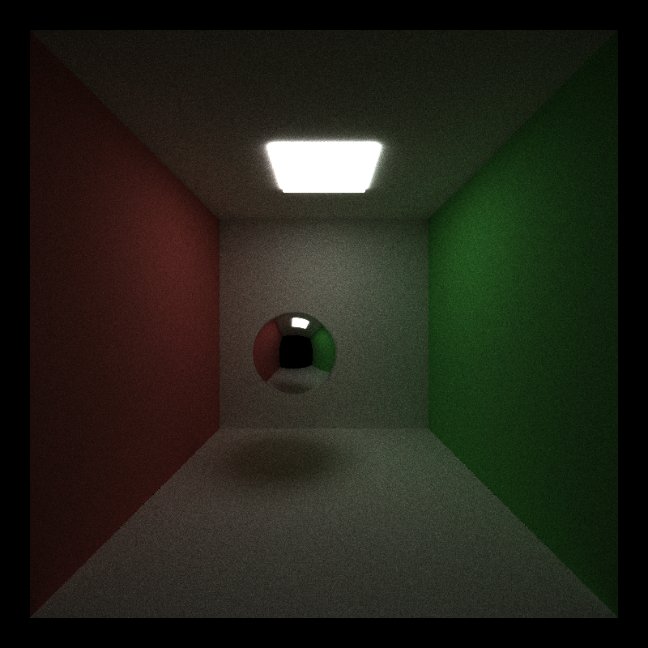
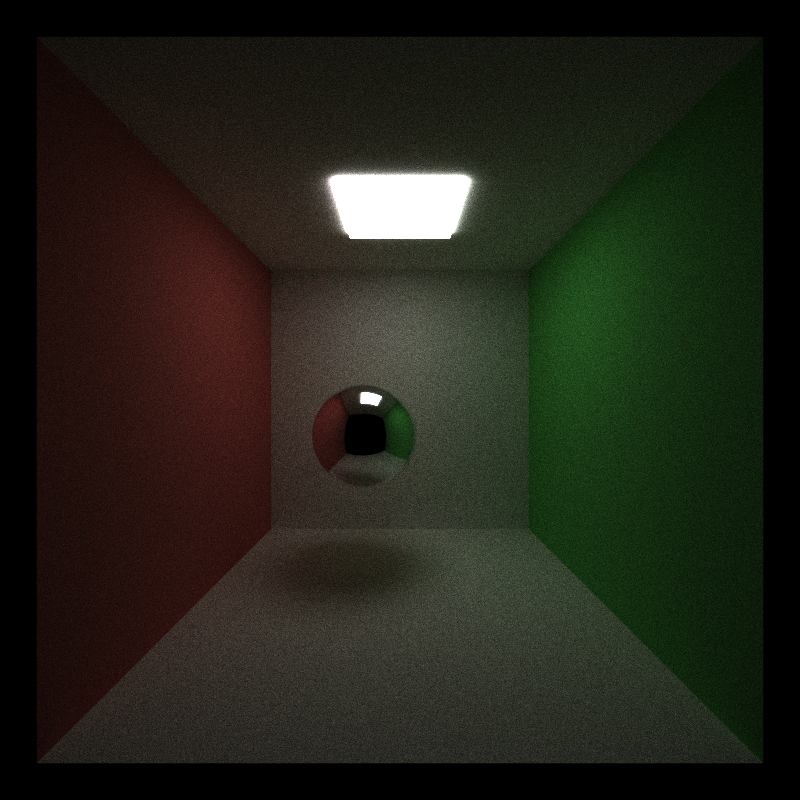
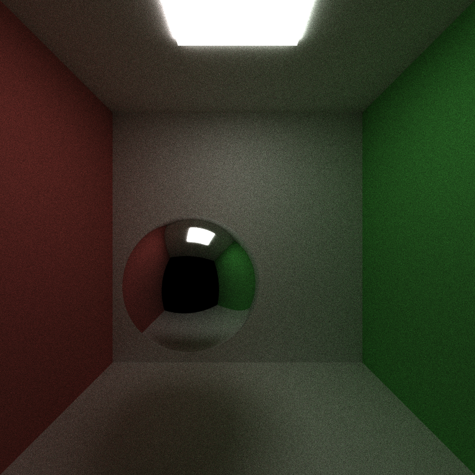
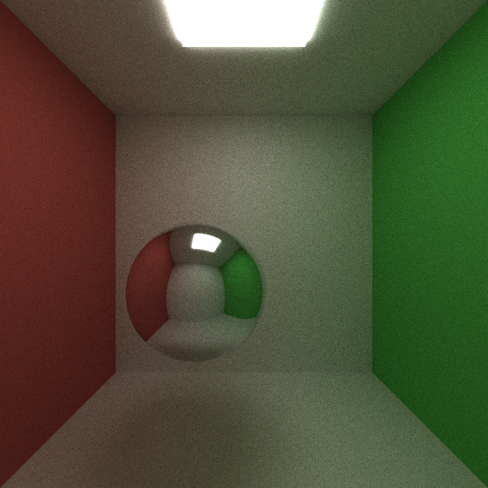

# Results and evidence

This appendix keeps measurement scope, additional figures, and raw-data links outside the [main README](../README.md). Results were collected during development on September 24–27, 2026; writing the README did not trigger new performance measurements. The datasets describe historical snapshots, which may differ from the current code. Only selected images and small measurement records are distributed; stage source/build snapshots stay local. Embedded CSV/JSON paths are original capture locators. The [evidence manifest](data/evidence_manifest.json) records each retained file's origin and SHA-256.

## Measurement scope

- **Whole program:** process start to exit, including scene loading, initialization, rendering, preview, image saving, and cleanup.
- **Render loop:** production CUDA code called by a headless driver, including existing synchronization and image readback, excluding loading, initialization, warmup, and saving.
- **GPU intervals:** CUDA-event measurements in a separate instrumentation build, checked against production output. These are not interchangeable with either wall-time measure.

Warmup and diagnostic runs are excluded from reported benchmark medians. GPU workloads were run serially, but clocks and desktop background load were not locked. Recorded min–max ranges are observations, not confidence intervals. Compare settings within the same experiment rather than comparing absolute times across stages.

[Hardware / OS record](data/host_environment.json)

## Antialiasing

At 800 × 800, 1000 spp, depth 8, whole-program medians were 17.644085 s with AA off and 18.262311 s with AA on, from three interleaved runs per setting after warmup. The observed increase was 3.50%; this is not an isolated camera-kernel measurement. The main README uses the emissive-sphere diagnostic to make edge coverage easier to see.

| AA off | AA on |
| --- | --- |
|  |  |

These paired images share the same executable, scene, camera, depth, and sample count. [Raw timing CSV](data/aa_timings.csv).

## Path organization

### Compaction

The open/closed comparison uses the same camera at (0, 5, 4.5); only the closed scene has a front wall behind it. Both use 800 × 800, 1000 spp, depth 8, and AA. Three interleaved measured runs per setting follow warmup. Exact whole-program medians are:

| Scene | Off (s) | On (s) | Time reduction |
| --- | ---: | ---: | ---: |
| Open | 19.652652 | 15.025496 | 23.54% |
| Closed | 21.393727 | 21.264138 | 0.61% |

The active-path plot in the main README counts surviving paths after shading in sample iteration 1. The final drop includes the depth cap; it does not mean every path reached a light or escaped. Off/on trajectories are identical. Summed input-range lengths fell by 34.88% in the open scene and 6.57% in the closed scene. These are logical path slots, not exact thread launches or triangle-intersection counts; dead-path threads already return early without compaction.

A hypothetical CPU implementation also benefits from removing dead work. On the GPU, packing paths additionally reduces mostly inactive thread blocks, at the cost of selection and movement. Future work could compact only when enough paths have died and reuse temporary storage.

| Open scene | Closed scene |
| --- | --- |
|  |  |

The compaction off/on PNGs are byte-identical, so one copy per scene is retained. [Timing CSV](data/compaction_timings.csv) · [Per-bounce CSV](data/compaction_path_counts.csv).

### Material sorting

The sorting experiment used a later snapshot and remeasured all four sorting/compaction combinations. Its times must not be substituted into the compaction experiment. All combinations produced identical PNGs for each matched scene. Three-run whole-program medians, 800 × 800, 1000 spp, depth 8, AA enabled:

| Scene | Compaction | Sorting off (s) | Sorting on (s) |
| --- | --- | ---: | ---: |
| Open | Off | 18.452 | 59.704 |
| Open | On | 13.946 | 47.561 |
| Closed | Off | 20.151 | 64.754 |
| Closed | On | 20.121 | 64.881 |

Sorting keeps full path and intersection records paired while grouping BSDF categories. Better grouping did not compensate for key generation, sorting, and data movement for the measured diffuse/specular scenes. The separate diagnostic chart includes Thrust dispatch/allocation/synchronization gaps; its intervals are not isolated kernel instruction costs. Counts of mixed groups are a structural proxy, not a measured hardware branch-efficiency counter.

Future work could compare compact indices or category partitioning, especially with more expensive BSDFs. This is a hypothesis to measure, not an observed speedup.

[Raw timings](data/sorting_timings.csv) · [Summary](data/sorting_summary.csv) · [Phase timings](data/sorting_phase_timings.csv) · [Grouping counts](data/sorting_material_layout.csv) · [Grouping illustration](images/sorting_material_order.png)

## OBJ meshes and BVH

The loader imports OBJ geometry, triangulates polygons with Earcut, and retains independent corner UV/normal indices. Materials are assigned per mesh in JSON; MTL material graphs are not imported automatically. Optional interpolated normals and sRGB base-color textures were added for the weapon showcase.

Each mesh receives a flat binary BVH in local space. The CPU splits triangle centroids by count; the GPU uses iterative near-first traversal with interval AABB tests and a current closest-hit limit. Brute force and a single mesh AABB remain available as controls.

*These comparison images use 256 × 256, 256 spp, depth 8. Brute-force, AABB, and BVH PNGs agree exactly; the difference column shows brute force versus BVH. Performance measurements instead use 64 spp.*

The main README's three-mode table uses the **final validated dataset**: six balanced rounds covering all mode orderings, AA/compaction on, sorting off. These measurements follow a floating-point consistency fix; earlier diagnostic runs are excluded.

For the exterior torus, BVH reduces GPU intersection time from 76.537 to 2.140 ms/spp, while whole-program time falls from 5.666 to 0.939 s. Those are different measurement scopes. The simple scene has three 12-triangle meshes; overlapping leaf bounds cause all triangles to remain candidates after a root hit, so BVH adds traversal work. A single AABB is also less effective for rays starting inside the box; BVH can still reject subtrees.

BVH-off configurations still build and upload the arrays to support toggling. Thus the experiment isolates traversal choices within the same application, not the startup savings of completely removing BVH support.

| Feature | Hypothetical CPU comparison | Further optimization |
| --- | --- | --- |
| OBJ and mesh AABB | Parsing already runs on the CPU. A CPU ray tracer gets the same geometric pruning, while the GPU processes many independent rays; divergent hit/miss decisions and transfer costs can reduce that benefit. | Cache repeated mesh assets and profile object-level acceleration when object counts grow. |
| BVH | Both CPU and GPU benefit from fewer triangle tests. GPU traversal exposes more ray parallelism but also incurs divergent control flow, scattered reads, and per-thread stack storage. No CPU/GPU speedup was measured. | Small-mesh fallback, SAH splits, leaf-size tuning, and stack/register profiling. |

The validated stage passed 136 GPU regression cases, full-scene ray audits with zero differences, and memory checks with zero errors/leaks. Later appearance tests also checked interpolated normals and UVs across intersection modes.

[Timing chart with ranges](images/bvh_performance.png) · [Raw runs](data/bvh_timings.csv) · [Summary CSV](data/bvh_summary.csv) · [Validation](data/bvh_verification.json) · [Earlier standalone AABB data](data/aabb_results.json) · [Initial mesh rendering](images/mesh_import.png)

## Physical depth of field

Lens positions are uniform by disk area (`sqrt(u)` radial sampling). Rays converge on a plane perpendicular to the camera's forward direction at `FOCAL_DISTANCE`. Lens radius and axial focus distance use world units. Changing focus moves the sharp region; changing aperture controls defocus. Focus remains manual when the camera moves.

*640 × 400, 2048 spp, depth 8; radius 0.35, focus distances 7.7 / 10.5 / 14.2. The main README shows the complementary aperture comparison. Panels only arrange actual rendered images and add labels.*

Six balanced rounds at 320 × 200, 128 spp, depth 8 compare disabled DOF, enabled DOF with zero radius, and a finite aperture. AA, compaction, AABB, and BVH are enabled; sorting is off. The following off/on values are medians for all 128 samples:

| Scene | Render loop, off → on (ms) | Camera kernel, off → on (ms) |
| --- | ---: | ---: |
| Emissive checkerboards | 59.671 → 68.179 | 5.378 → 8.404 |
| Still life | 637.333 → 643.098 | 4.739 → 6.943 |

The still-life loop ranges overlap: 623.932–646.258 ms off, 639.728–651.897 ms on. Its camera-kernel median increases 46.5%, but intersections dominate the loop. Checkerboard loop time increases 14.3%, illustrating scene dependence; lens rays also change intersection work. CUDA-event kernel timings come from a separately verified instrumented build.

At 1024 spp, linear-RGB RMSE against each mode's own 8192-spp reference is 0.008064 for pinhole and 0.008821 for DOF. References use disjoint sample-number ranges and still contain noise. Intentional defocus is not treated as error. These values do not establish a runtime ratio at equal quality.

Independent lens samples map naturally to GPU threads. A hypothetical CPU version could use threads/SIMD but performs the same sampling and focal-plane arithmetic. The implementation reuses BVH/compaction and skips lens work when disabled or at zero radius. Future options include precomputing the lens frame, testing more uniform sample sequences at equal noise, and resetting accumulation without re-uploading static geometry. No CPU renderer timing was measured.

[Raw timing CSV](data/dof_timings.csv) · [Summary and ranges](data/dof_summary.csv) · [Validation](data/dof_verification.json) · [Convergence CSV](data/dof_convergence.csv) · [Timing chart](images/dof_performance.png) · [Convergence chart](images/dof_convergence.png)

## Showcase capture

The README cover uses `shatterseal_moonlit_hall_refined.json`: 1200 × 800, 3072 spp, depth 8, AA/compaction/BVH/DOF on, sorting off; lens radius 0.012 and focus distance 5.0. It contains 16 meshes and 86,355 triangles. The 810.481 s value is one headless render-loop capture after 8 spp warmup, not a repeated performance benchmark.

The refined scene passed mesh/BVH validation with no degenerate triangles; the raw output contains no NaN, Inf, or negative radiance. The stage changed scene assets and lighting while preserving the renderer source and binary. The backdrop, moon, and flames are textured geometry; candle flames are emissive surfaces, not simulated participating media. Larger fill emitters also contribute to illumination.

[Scene design and before/after](SCENE.md) · [Capture JSON](data/showcase_capture.json) · [Validation / hashes](data/showcase_verification.json). Full HDR and float32 captures remain in the local archive and can be regenerated with `scene_render`.

## Configuration and validation

The switches below belong to the JSON `Camera` object. Changing the corresponding GUI controls resets progressive accumulation.

| Field | Default if omitted | Purpose |
| --- | --- | --- |
| `ANTIALIASING` | `false` | Random subpixel sampling |
| `STREAM_COMPACTION` | `false` | Compact active paths |
| `MATERIAL_SORTING` | `false` | Group path/intersection pairs by BSDF category |
| `MESH_CULLING` | `true` | Single mesh AABB when BVH is off |
| `BVH` | `false` | Hierarchical mesh traversal; includes its own AABB tests |
| `DEPTH_OF_FIELD` | `false` | Enable thin-lens sampling |
| `LENS_RADIUS` | `0` | Nonnegative radius in world units; zero gives pinhole rays |
| `FOCAL_DISTANCE` | Initial `EYE`–`LOOKAT` distance | Positive axial focus distance in world units |
| `DISPLAY_TRANSFORM` | `false` | Exposure, Reinhard tone mapping, and sRGB output |
| `EXPOSURE` | `0` | Exposure in stops when the display transform is enabled |

For brute force set `BVH=false, MESH_CULLING=false`; for single AABB use `false,true`; for BVH set `BVH=true`. Mesh/material configuration examples are in the [showcase implementation notes](SCENE.md#material-configuration).

Beyond listing sources, CMake enables CTest and adds nine tests for loading, BVH construction, CPU/GPU camera sampling, GPU intersections, thin-lens rendering, ImGui controls, appearance, and the validation CLI. Test targets specify their include paths, CUDA compilation properties, and GPU timeout/skip handling; mesh diagnostics use the `PATHTRACE_TESTING` definition. The `scene_render` target runs production CUDA kernels without OpenGL. `BUILD_TESTING=OFF` omits tests but retains this capture tool.

The archived integration run passed 9/9 tests. The original weapon scene additionally passed 12 low-resolution combinations of intersection mode × compaction × sorting with maximum linear-RGB difference 0, and memory checks with zero errors/leaks. This does not claim a full-resolution brute-force rerender of the refined cover.

[CTest log](data/ctest_archived.txt) · [Showcase integration checks](data/appearance_verification.json) · [DOF validation](data/dof_verification.json)

Submission packaging was verified separately with a clean Release build containing only the selected files: 9/9 CTest targets passed, all 12 included scenes loaded successfully, and a 48 × 32, 4-spp, depth-8 DOF showcase render matched the working executable byte-for-byte in PNG and linear float32 RGB. This is a portability check, not a new benchmark. [Submission verification](data/submission_validation.json) · [Clean CTest log](data/submission_ctest.txt).
