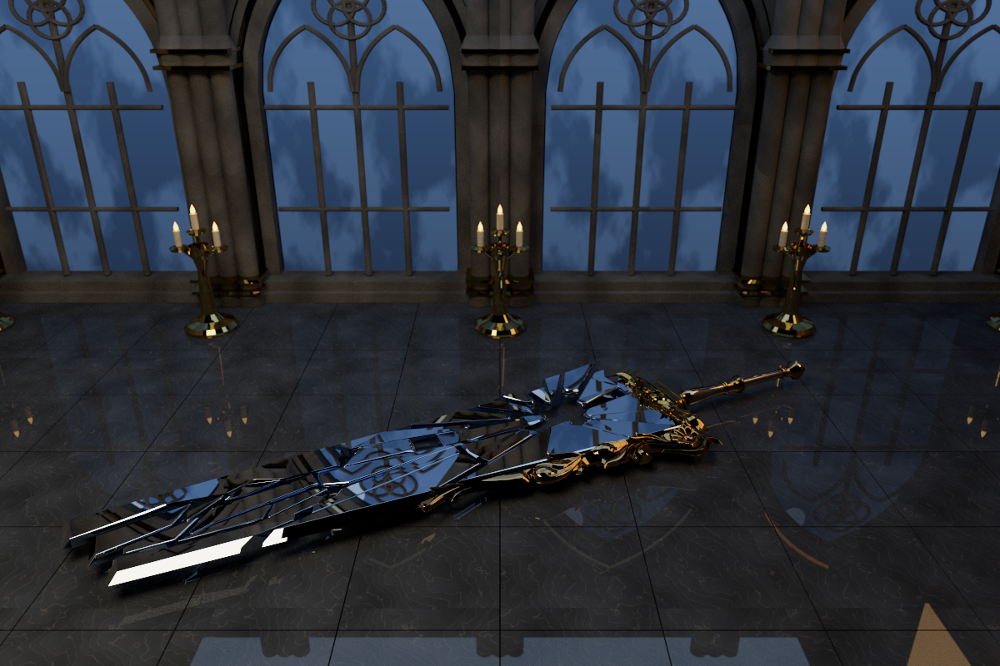

# Moonlit hall showcase

[Main README](../README.md) · [Measurements](RESULTS.md#showcase-capture)

The final scene places Shatterseal Drakesnest flat on a stone floor, with Gothic windows, five candelabra, and a continuous night backdrop. The hall and candles were generated offline; all geometry and textures required to render are included. Python and the original extraction directory are not required to load the scene.

| Earlier lighting | Final environment |
| --- | --- |
|  |  |

Both images use 1200 × 800, 3072 spp, depth 8, and the same camera and display parameters. The earlier scene configuration is retained locally; only its comparison image is distributed.

## Scene entry points

- [Preview](../scenes/shatterseal_moonlit_hall_refined_preview.json): 600 × 400, 256 spp, pinhole camera.
- [Final cover](../scenes/shatterseal_moonlit_hall_refined.json): 1200 × 800, 3072 spp, lens radius 0.012, focus distance 5.0.
- [Detail camera](../scenes/shatterseal_moonlit_hall_refined_detail.json): 960 × 640, 2048 spp. This configuration is provided for further rendering; a final capture is not included.

The final scene has 16 meshes and 86,355 triangles. The one recorded render loop took 810.481 s on an RTX 4070 Laptop GPU, excluding initialization and warmup. [Capture record](data/showcase_capture.json).

## Environment and lighting

All windows share one distant textured plane. A separate moon mesh appears once, while an upper sky extension supplies the high-angle directions reflected by the flat blade. This is a finite textured set, not a full outdoor model or a spherical environment map.

Larger fill emitters support the weapon and floor. The final setup replaces hard-edged light boxes with textured falloff and revises the candelabra with curved arms, wax, wicks, and shaped emissive flames. Flames are emitting surfaces; there is no volume simulation, bloom, or direct-light sampling. Small-source lighting can remain noisy at low sample counts.

## Material configuration

| Field | Location | Behavior |
| --- | --- | --- |
| `SMOOTH_NORMALS: true` | Mesh object | Interpolates OBJ corner normals; mirror faces retain flat shading. |
| `BASE_COLOR_TEXTURE` | Material | Image path relative to scene JSON; sRGB decoding and bilinear sampling in linear space. |
| `TYPE: "CoatedDiffuse"`, `COAT_WEIGHT` | Material | Samples a mixture of Lambertian diffuse and ideal reflection; not a rough microfacet model. |
| `DISPLAY_TRANSFORM`, `EXPOSURE` | Camera | Exposure in stops, Reinhard mapping, and sRGB PNG encoding; raw/HDR output stays linear. |

Each mesh receives one material from JSON. MTL shading and normal/roughness maps are not automatically imported. [Full scene configuration](../scenes/shatterseal_moonlit_hall_refined.json).

## Weapon asset

The weapon geometry and original textures come from a user-extracted **Monster Hunter Wilds** asset by **CAPCOM**. They are external artwork, not original modeling produced by this renderer.

| Component | Included file | Triangles |
| --- | --- | ---: |
| Mirror faces | [mirror.obj](../scenes/models/shatterseal_drakesnest/parts/mirror.obj) | 1,972 |
| Fragment edges | [edges.obj](../scenes/models/shatterseal_drakesnest/parts/edges.obj) | 4,249 |
| Frame, guard, and handle | [metal.obj](../scenes/models/shatterseal_drakesnest/parts/metal.obj) | 28,260 |

The default assembly contains 34,481 triangles. The extra black overlay and merged duplicate exports remain local. Original positions, corner UVs, normals, and winding are preserved. Rotation `[-90, 0, -65]` and scale 1.8 are applied by the scene, turning the blade face toward world +Y.

Only [Metal_basecolor.png](../scenes/models/shatterseal_drakesnest/textures/baked/Metal_basecolor.png) is used from the original texture set. The tiny source MTL is included because the OBJ files declare it; its unused map names are provenance only. Texture loading is controlled by the scene JSON, and the other game maps are intentionally excluded from the render package.

## Asset sources

- **Weapon and original color texture:** Monster Hunter Wilds / CAPCOM, extracted and supplied by the project owner.
- **Hall, candles, floor layout, and procedural material textures:** generated by project scripts during scene construction; the final assets are included directly.
- **Concept references and distant night texture:** OpenAI image generation. The distant image is a texture asset, not the final rendered picture. [Generation prompt](data/sky_prompt.txt); the background texture is [night_exterior.png](../scenes/models/moonlit_hall_refined/night_exterior.png).
- **Measured PNGs and charts:** byte-identical selections from the recorded experiments. [File origins and hashes](data/evidence_manifest.json).

The README's final image is produced by the CUDA path tracer with its display transform, without external denoising or compositing.
